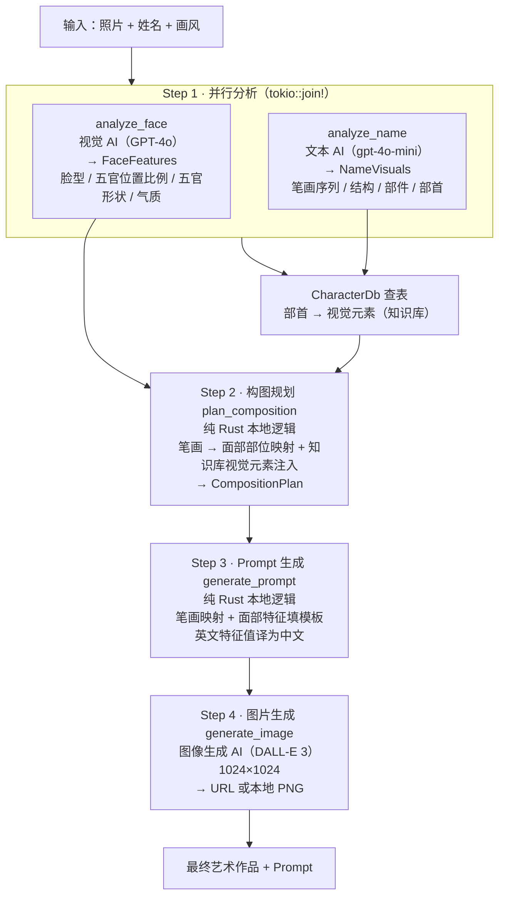

# 字相 (Zixiang) · 姓名人像艺术生成 Agent

> **字有相，人有相。字相 Agent，让名字和面孔在艺术中相遇。**

[](https://www.rust-lang.org/)

## 项目简介

**「字相」** 是一个基于 AI 的个性化肖像创作 Agent，核心理念是 **“字即是相，相即是字”**——将人物的姓名汉字与面部特征深度融合，生成独一无二的姓名人像艺术作品。

与普通 AI 绘画工具不同，字相不是简单地“根据照片画一个人”，而是**用姓名中每个汉字的笔画、部件和结构，去“拼凑”出人物的面部特征**。最终作品既保留了人物的相貌神韵，又嵌入了姓名汉字的视觉基因，让每一幅肖像都成为“只有这个人和这个名字才能生成”的专属艺术品。

## 核心创意

**用汉字笔画拼凑人脸。**

想象一下：用户上传一张照片，输入姓名「李白」，Agent 会分析出：

- 面部特征：长脸、细长眼、高鼻梁、薄嘴唇
- 姓名结构：「李」由「木」+「子」组成，「白」是独体字，部首分别为「木」与「白」

然后 Agent 将两者融合：

- 用「木」的竖画作鼻梁
- 用「子」的横折钩勾勒眉弓
- 用「白」的横折描绘眼睛轮廓
- 用「李」的撇捺构成下颌线条

最终生成一幅**用汉字笔画拼凑而成的人脸肖像**，让观者既能认出这是「李白」的脸，又能看到「李白」这两个字的结构之美。

## 项目定位

这是一个**高度场景定制的专用 AI Agent**，而不是一个通用的“文生图”工具。它专门服务于一个场景：

> 用户拥有一个人物的照片和姓名，希望生成一幅“体现这个人相貌与这个名字特征”的专属艺术肖像。

通用 AI 绘画工具可以“画一个人”，但无法理解「李」字的竖画应该用来画鼻梁，「白」字的横折应该用来画眼睛。只有专为此场景设计的 Agent，才能将汉字的结构之美与人物肖像完美融合。

## Agent 工作流

输入：**照片（URL 或 base64）+ 姓名 + 画风**（默认「水墨写意」）



> **实现细节**：Step 1 中面部分析与汉字分析用 `tokio::join!` 并行执行；汉字分析完成后，立即用本地知识库（`data/characters.json`）为每个字的部首查出视觉元素，注入 Step 2 的构图计划，最终体现在 Prompt 的装饰元素中。

| 步骤 | 模块 | 是否调用 API |
| --- | --- | --- |
| Step 1 · 视觉分析 | `tools/face_analysis.rs` | 是（视觉 AI） |
| Step 1 · 汉字分析 | `tools/name_analysis.rs` | 是（文本 AI） |
| Step 1 · 知识库查表 | `knowledge/character_db.rs` | 否（本地） |
| Step 2 · 构图规划 | `tools/composition_planner.rs` | 否（纯 Rust） |
| Step 3 · Prompt 生成 | `tools/prompt_generator.rs` | 否（纯 Rust） |
| Step 4 · 图片生成 | `tools/image_generator.rs` | 是（图像 AI） |

## 技术架构

### 后端（Rust）

| 模块 | 职责 |
| --- | --- |
| `main.rs` | 入口：CLI 模式 + `serve` Web 服务模式 |
| `lib.rs` | 模块导出：`agent` / `config` / `knowledge` / `server` / `tools` / `types` |
| `agent/loop.rs` | Agent 主循环，端到端流程编排（`run_pipeline`） |
| `tools/face_analysis.rs` | 调用视觉 AI 分析面部特征 → `FaceFeatures` |
| `tools/name_analysis.rs` | 调用文本 AI 拆解姓名汉字 → `NameVisuals` |
| `tools/composition_planner.rs` | 笔画→面部映射的核心确定性逻辑 |
| `tools/prompt_generator.rs` | 生成最终艺术 Prompt（含特征值中译） |
| `tools/image_generator.rs` | 调用图像生成 AI |
| `knowledge/character_db.rs` | 汉字部首→视觉元素知识库（加载 `data/characters.json`） |
| `config.rs` | 多 API 适配器（`ApiProvider`，共享默认 + 分端点覆盖） |
| `server.rs` | axum Web 服务，托管 `static/` 并提供 `POST /api/generate` |
| `types.rs` | `FaceFeatures` / `CharacterVisual` / `CompositionPlan` 等数据结构 |

### 前端

- 中国风（新中式 / 禅意）Web 界面：纯 HTML + CSS + JavaScript 单文件 `static/index.html`
- 配色：米白 / 墨黑 / 朱红 / 金色（CSS 变量管理），字体 Noto Serif SC
- 支持图片拖拽上传、姓名输入、6 种画风选择、四步实时进度、结果评分卡与可折叠 Prompt 查看
- 由服务器托管时自动对接真实后端；直接打开（`file://`）则进入离线演示模式

### 多 API 支持

Agent 的三个核心任务——**视觉分析**、**文本推理**、**图片生成**——可分别使用不同的 API 服务商，通过 `.env` 自由组合，无需改代码：

| 任务 | 可用 API |
| --- | --- |
| 视觉分析 | OpenAI GPT-4o、米醋 API、API2D、OpenRouter 等 OpenAI 兼容接口 |
| 文本推理 | OpenAI gpt-4o-mini、米醋 API、API2D、OpenRouter 等 OpenAI 兼容接口 |
| 图片生成 | OpenAI DALL-E 3、米醋 API、API2D 等兼容 `/images/generations` 的中转 |

> 配置采用“共享默认 + 分端点覆盖”：共享变量（`OPENAI_API_KEY`、`API_BASE_URL` 等）对所有端点生效；以 `VISION_` / `TEXT_` / `IMAGE_` 前缀的变量可针对单端点覆盖（如 `VISION_API_KEY`、`IMAGE_API_BASE_URL`）。支持 Bearer / Header / Query 三种认证与 url / b64_json / auto 三种图片响应格式。

## 四项场景定制

课程要求至少**两项针对场景的专门优化**，本项目实现了四项：

### 定制一：汉字视觉知识库

不是简单让 LLM 解释汉字含义，而是建立了**部首→视觉元素的映射表**（`data/characters.json`，编译期通过 `include_str!` 嵌入二进制）：

```json
{
  "木": { "visual": ["tree", "branch", "forest", "wood_texture"] },
  "氵": { "visual": ["water", "river", "wave", "reflection"] }
}
```

姓名中每个汉字被拆解出部首后，由 `knowledge/character_db.rs` 查表提取对应视觉元素，并注入最终 Prompt 的装饰元素。这确保姓名特征**可控、可复现**，而非完全依赖 LLM 的随意发挥——目前已覆盖 50+ 常用部首。

### 定制二：笔画→面部映射规则

将汉字笔画与面部特征建立**确定性映射**（`tools/composition_planner.rs`，纯 Rust 本地逻辑）：

| 面部部位 | 使用的笔画 | 依据 |
| --- | --- | --- |
| 鼻梁 | 竖 | 纵向线条 |
| 眼睛 | 横折 + 点（眼珠） | 有弧度的横向线条 |
| 眉毛（平直） | 横 | 水平线条 |
| 眉毛（弯） | 撇 / 横折 | 有弧度的线条 |
| 嘴唇（薄） | 横 | 细长线条 |
| 嘴唇（厚） | 横折 + 点 | 饱满线条 |
| 脸型（长脸） | 竖、撇、捺 | 纵向笔画 |
| 脸型（圆脸） | 横、横折、竖弯钩 | 横向笔画 |
| 长发 | 撇、捺 | 飘逸线条 |
| 短发 | 横、竖 | 短促线条 |

这套映射是**程序固化的确定性逻辑**，确保每次构图都符合人物实际特征，而非模型随机输出。

### 定制三：多 API 独立配置

视觉、文本、图片生成三个任务分别配置独立的 API（`config.rs` 的分层环境变量），可自由组合不同服务商，最大化利用各平台优势与免费额度。

### 定制四：生成→评价→迭代（计划中）

图片生成后自动评价人脸相似度与姓名元素融合度，评分不足时自动重绘，形成闭环迭代。（前端已预留评分卡 UI，闭环逻辑待后续实现。）

## 用户交互流程

1. **打开网页** → 看到「字相」中国风界面
2. **上传照片** → 点击或拖拽上传人物头像
3. **输入姓名** → 填写要生成肖像的人物姓名
4. **选择风格** → 水墨 / 工笔 / 油画 / 赛博朋克 / 浮世绘 / 印象派
5. **点击创作** → Agent 开始工作
6. **实时进度** → 显示「面部特征 → 汉字解析 → 构图规划 → 图像生成」四个步骤
7. **展示结果** → 输出最终肖像 + 匹配度评分 + 可查看 Prompt

## 快速开始

### 前置要求

- Rust 工具链（edition 2024，建议 Rust ≥ 1.85）
- 一个可用的 API Key（OpenAI 或兼容的第三方服务）

### 安装

```bash
git clone https://github.com/lantingxu2025/zixiang-agent
cd zixiang-agent
```

### 配置环境变量

复制 `.env.example` 为 `.env` 并填入 API Key：

```bash
cp .env.example .env
```

### 运行

**CLI 模式**（直接生成肖像）：

```bash
# 默认画风（水墨写意）
cargo run --release -- 李明 https://example.com/photo.jpg

# 指定画风
cargo run --release -- 李明 https://example.com/photo.jpg 工笔白描
```

| 参数 | 说明 | 必填 |
| --- | --- | --- |
| `姓名` | 被分析者的中文姓名，如 `李明` | 是 |
| `照片URL` | 人物照片的 URL 或 base64 编码 | 是 |
| `画风` | 如 `水墨写意`、`工笔白描`，默认 `水墨写意` | 否 |

**Web 服务模式**（前端对接真实 pipeline）：

```bash
cargo run --release -- serve          # 默认 3000 端口
cargo run --release -- serve 8080     # 指定端口
```

启动后访问 `http://127.0.0.1:3000`：拖拽上传照片 → 输入姓名 → 选画风 → 点「开始创作」。前端会把照片（data URL）、姓名、画风 POST 到 `/api/generate`，后端运行完整四步 pipeline 返回真实 Prompt 与图片。

> 直接用浏览器打开 `static/index.html`（`file://`）则进入**离线演示模式**，无需 API Key。

## 环境变量配置

配置采用“**共享默认 + 分端点覆盖**”的分层结构。端点划分：

- `VISION_*`：视觉识别（`analyze_face`，GPT-4o）
- `TEXT_*`：文本推理（`analyze_name`，gpt-4o-mini）
- `IMAGE_*`：图片生成（`generate_image`，DALL-E 3 / 第三方画图中转）

```bash
# ===== 共享默认（对所有端点生效） =====
OPENAI_API_KEY=sk-xxx          # 必填（也可用 API_KEY）
API_BASE_URL=https://api.openai.com/v1   # 也可写 API_BASE
AUTH_STYLE=bearer              # bearer / header / query
IMAGE_RESPONSE_FORMAT=auto     # url / b64_json / auto

# ===== 模型名 =====
VISION_MODEL=gpt-4o
TEXT_MODEL=gpt-4o-mini
IMAGE_MODEL=dall-e-3
IMAGE_SIZE=1024x1024           # 图片尺寸

# ===== 分端点覆盖（可选，优先级高于共享默认） =====
VISION_API_BASE_URL=https://api.openai.com/v1   # 也可写 VISION_API_BASE
VISION_API_KEY=sk-xxx
TEXT_API_BASE_URL=https://api.openai.com/v1
IMAGE_API_BASE_URL=https://api.openai.com/v1
IMAGE_API_KEY=sk-yyy
# 还可分端点覆盖 AUTH_STYLE / IMAGE_RESPONSE_FORMAT 等
# EXTRA_HEADERS=HTTP-Referer:https://x.com;X-Title:zixiang   # 如 OpenRouter
```

| 变量 | 说明 | 默认值 | 必填 |
| --- | --- | --- | --- |
| `OPENAI_API_KEY` | API Key（也可用 `API_KEY`） | — | 是 |
| `API_BASE_URL` | API 基础地址（别名 `API_BASE`） | `https://api.openai.com/v1` | 否 |
| `AUTH_STYLE` | 认证方式 `bearer` / `header` / `query` | `bearer` | 否 |
| `IMAGE_RESPONSE_FORMAT` | 图片响应 `url` / `b64_json` / `auto` | `auto` | 否 |
| `VISION_MODEL` | 视觉模型名 | `gpt-4o` | 否 |
| `TEXT_MODEL` | 文本模型名 | `gpt-4o-mini` | 否 |
| `IMAGE_MODEL` | 图片模型名 | `dall-e-3` | 否 |
| `IMAGE_SIZE` | 图片尺寸 | `1024x1024` | 否 |
| `EXTRA_HEADERS` | 额外请求头 `K1:V1;K2:V2` | 空 | 否 |
| `VISION_*` / `TEXT_*` / `IMAGE_*` | 分端点覆盖以上任意配置 | 回退共享默认 | 否 |

> **鉴权**：`bearer` 发 `Authorization: Bearer <key>`；`header` 将 key 放自定义头（不加 Bearer）；`query` 将 key 作 URL 参数。`EXTRA_HEADERS` 适用于 OpenRouter 的 `HTTP-Referer` / `X-Title`。

## 技术栈

### Rust 后端

- **axum**：Web 服务器（`serve` 模式）
- **tokio**：异步运行时（`macros`、`rt-multi-thread`、`net`）
- **tower-http**：静态文件托管（`fs`）+ 跨域（`cors`）
- **reqwest**：HTTP 客户端（`rustls-tls`、`json`，调用 AI API）
- **serde / serde_json**：序列化
- **anyhow**：错误处理
- **base64**：图片 base64 解码
- **dotenv**：环境变量加载
- **tracing / tracing-subscriber**：日志

### 前端

- 纯 HTML + CSS + JavaScript 单文件（`static/index.html`）
- 中国风设计，外部依赖仅 Google Fonts（Noto Serif SC）
- 响应式布局，CSS 变量主题管理，CSS keyframes 动画

## 项目亮点

1. **创意独特**：用汉字笔画拼凑人脸，目前市面上没有同类产品
2. **真正专用**：不是通用 Agent 套壳，而是为“姓名肖像”场景深度定制
3. **知识库可控**：部首→视觉元素本地知识库，姓名特征可复现、不靠 LLM 随机
4. **确定性构图**：笔画→面部映射为纯 Rust 固化逻辑，每次构图都符合人物真实特征
5. **多 API 灵活配置**：各任务独立选择最优服务商
6. **Rust 核心**：Agent 循环、工具编排、状态管理全部 Rust 实现
7. **中国风 UI**：与项目主题高度一致的视觉设计

## 适用场景

- 个人艺术肖像定制
- 姓名文化创意产品
- 汉字艺术教育工具
- 游戏角色概念设计
- 品牌 IP 视觉开发

## 后续迭代方向

1. **生成→评价→迭代闭环**：生成后自动评价人脸相似度与姓名融合度，不足时自动重绘
2. **Pollinations.ai 等更多图像端点**：接入非 OpenAI 兼容的图片 API
3. **历史记录**：保存每次生成的照片、姓名、Prompt、结果
4. **Token 统计**：精确统计每次 API 调用用量与费用
5. **批量生成**：一次上传多张照片，批量创作
6. **更多风格**：持续扩充艺术风格选项

## 项目链接

- GitHub：[https://github.com/lantingxu2025/zixiang-agent](https://github.com/lantingxu2025/zixiang-agent)

---

> **“字有相，人有相。字相 Agent，让名字和面孔在艺术中相遇。”**
