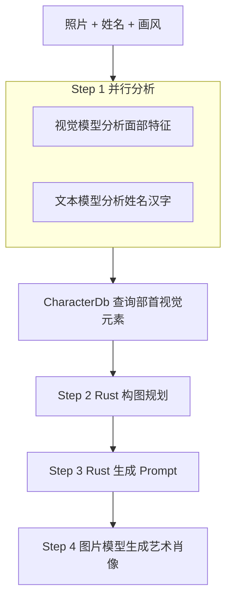

# 字相 Agent

> 字有相，人有相。让名字和面孔在艺术中相遇。

字相是一个面向“姓名人像艺术创作”场景的 AI Agent。用户提供人物照片、姓名和艺术风格，系统分析面部特征与姓名汉字结构，再用确定性的汉字笔画映射生成构图计划和 Prompt，最后调用图片模型生成艺术肖像。

## 功能概览

- 上传人物照片，支持点击选择和拖拽上传。
- 输入中文姓名，逐字分析笔画、结构、部件和部首。
- 选择水墨、工笔、油画、赛博朋克、浮世绘或印象派风格。
- 在网页中配置 API Key 与 API Base URL，不需要手动编辑 `.env`。
- 实时查看真实 Agent 流程：面部分析、姓名解析、构图规划、Prompt 生成和图片生成。
- 查看面部特征、姓名汉字视觉信息、构图计划、最终 Prompt 和生成图片。
- 支持 OpenAI 以及兼容 OpenAI Chat Completions 和 Images Generations 接口的服务商。

> UI 必须通过 Rust Web 服务访问。直接打开 `static/index.html` 不能连接后端，也不能运行真实 Agent 流程。

## 工作流程



| 阶段 | 实现 | 是否调用外部 API | 输出 |
| --- | --- | --- | --- |
| 面部分析 | `src/tools/face_analysis.rs` | 是 | `FaceFeatures` |
| 姓名分析 | `src/tools/name_analysis.rs` | 是 | `NameVisuals` |
| 部首知识库 | `src/knowledge/character_db.rs` | 否 | 视觉元素 |
| 构图规划 | `src/tools/composition_planner.rs` | 否 | `CompositionPlan` |
| Prompt 生成 | `src/tools/prompt_generator.rs` | 否 | Prompt 文本 |
| 图片生成 | `src/tools/image_generator.rs` | 是 | 图片 URL 或本地 PNG |

Step 1 中面部分析和姓名分析通过 `tokio::join!` 并行执行。姓名分析完成后，程序从 `data/characters.json` 查询部首对应的视觉元素，并将其加入构图计划和最终 Prompt。

## 环境要求

- Rust 1.85 或更高版本（edition 2024）
- 一个可用的 OpenAI 或兼容服务商 API Key
- Chrome、Edge、Firefox 等现代浏览器

检查 Rust 环境：

```bash
rustc --version
cargo --version
```

## 安装

```bash
git clone https://github.com/lantingxu2025/zixiang-agent.git
cd zixiang-agent
cargo build --release
```

编译不需要 API Key。若看到 `Finished release profile`，说明编译成功。

## 使用 Web UI

Web UI 是项目的完整使用入口。

### 1. 启动服务

```bash
# 默认端口 3000
cargo run --release -- serve

# 指定端口
cargo run --release -- serve 8080
```

浏览器访问：

```text
http://127.0.0.1:3000
```

### 2. 在网页配置 API

页面顶部的 API 配置区支持：

- `API Key`：必填。
- `API Base URL`：可选，默认使用 `https://api.openai.com/v1`。
- “保存配置”：将配置提交给本地服务，写入项目根目录 `.env` 并立即热更新。

也可以在启动前手动创建 `.env`：

```dotenv
OPENAI_API_KEY=sk-your-key
```

### 3. 创作肖像

1. 上传人物照片。
2. 输入中文姓名，例如 `李白`。
3. 选择艺术风格。
4. 点击“开始创作”。
5. 等待四步真实流程完成。
6. 查看生成图片，并展开 Prompt、面部分析、姓名解析和构图计划。

页面通过 `POST /api/generate` 接收 SSE 流，因此进度和中间结果都来自后端 Agent，而不是浏览器模拟数据。

## CLI 使用

CLI 与 Web UI 复用同一套 Agent pipeline：

```bash
# 默认风格：水墨写意
cargo run --release -- 李明 https://example.com/photo.jpg

# 指定风格
cargo run --release -- 李明 https://example.com/photo.jpg 工笔白描
```

参数：

| 参数 | 说明 | 必填 |
| --- | --- | --- |
| 姓名 | 中文姓名，例如 `李明` | 是 |
| 照片 URL | HTTP/HTTPS 图片 URL、data URL 或裸 base64 | 是 |
| 画风 | 任意风格描述，默认 `水墨写意` | 否 |

CLI 会在终端输出最终 Prompt 和图片 URL 或本地 PNG 文件路径。

## API 接口

Web 服务由 `src/server.rs` 提供：

### `GET /api/status`

检查服务是否已配置 API，并返回当前模型和基础地址。示例响应：

```json
{
  "status": "ok",
  "configured": true,
  "models": {
    "vision_model": "gpt-4o",
    "text_model": "gpt-4o-mini",
    "image_model": "dall-e-3",
    "image_size": "1024x1024",
    "base_url": "https://api.openai.com/v1"
  }
}
```

### `POST /api/config`

保存并热更新配置：

```json
{
  "api_key": "sk-your-key",
  "api_base": "https://api.openai.com/v1"
}
```

### `POST /api/generate`

请求：

```json
{
  "name": "李白",
  "image": "data:image/jpeg;base64,...",
  "style": "中国水墨"
}
```

响应类型为 `text/event-stream`，事件包括：

| 事件 | 内容 |
| --- | --- |
| `step` | 步骤编号及 `active` / `done` 状态 |
| `face` | 面部特征 JSON |
| `name_vis` | 姓名汉字视觉信息 JSON |
| `plan` | 构图计划 JSON |
| `prompt` | 最终图片 Prompt |
| `image` | 图片 URL 或 data URL |
| `error` | 流程错误信息 |
| `done` | 流程结束 |

## API 配置

配置采用“共享默认 + 分端点覆盖”。分端点配置优先于共享配置。

### 共享配置

```dotenv
# 必填，也可以使用 API_KEY
OPENAI_API_KEY=sk-your-key

# 也可以使用 API_BASE
API_BASE_URL=https://api.openai.com/v1

# bearer、header 或 query
AUTH_STYLE=bearer

# url、b64_json 或 auto
IMAGE_RESPONSE_FORMAT=auto

VISION_MODEL=gpt-4o
TEXT_MODEL=gpt-4o-mini
IMAGE_MODEL=dall-e-3
IMAGE_SIZE=1024x1024
```

### 分端点覆盖

```dotenv
VISION_API_KEY=sk-vision-key
VISION_API_BASE_URL=https://vision.example.com/v1
VISION_MODEL=gpt-4o

TEXT_API_KEY=sk-text-key
TEXT_API_BASE_URL=https://text.example.com/v1
TEXT_MODEL=gpt-4o-mini

IMAGE_API_KEY=sk-image-key
IMAGE_API_BASE_URL=https://image.example.com/v1
IMAGE_MODEL=dall-e-3
IMAGE_SIZE=1024x1024
```

各端点前缀支持覆盖 `API_KEY`、`API_BASE_URL`、`AUTH_STYLE`、`AUTH_HEADER_NAME`、`AUTH_QUERY_PARAM`、`EXTRA_HEADERS` 和图片响应格式。

### 认证方式

| `AUTH_STYLE` | 行为 |
| --- | --- |
| `bearer` | `Authorization: Bearer <key>`，默认方式 |
| `header` | 将 Key 直接放入指定请求头 |
| `query` | 将 Key 放入 URL 查询参数 |

自定义请求头格式：

```dotenv
EXTRA_HEADERS=HTTP-Referer:https://example.com;X-Title:zixiang-agent
```

### 图片响应格式

| 值 | 行为 |
| --- | --- |
| `url` | 使用响应中的 `data[].url` |
| `b64_json` | 解码 `data[].b64_json`，保存为当前工作目录的 `字相_时间戳.png` |
| `auto` | 优先使用 URL，没有 URL 时回退到 base64 |

## 项目结构

```text
.
├── data/characters.json          # 部首到视觉元素的知识库
├── static/index.html             # Web UI
├── src/
│   ├── main.rs                   # CLI 和 Web 服务入口
│   ├── server.rs                 # axum 服务、静态文件和 API
│   ├── config.rs                 # API 服务商与环境变量配置
│   ├── types.rs                  # 流程数据结构
│   ├── agent/loop.rs             # Agent pipeline
│   ├── knowledge/character_db.rs # 汉字知识库
│   └── tools/
│       ├── face_analysis.rs      # 面部视觉分析
│       ├── name_analysis.rs      # 姓名汉字分析
│       ├── composition_planner.rs# 构图规划
│       ├── prompt_generator.rs   # Prompt 生成
│       └── image_generator.rs    # 图片生成
├── Cargo.toml
└── README.md
```

## 常见问题

### 页面提示无法连接本地服务

不要直接双击打开 `static/index.html`。请在项目根目录运行：

```bash
cargo run --release -- serve
```

然后访问 `http://127.0.0.1:3000`。

### 页面提示尚未配置 API Key

在页面顶部输入 API Key 并点击“保存配置”，或者在项目根目录 `.env` 中设置 `OPENAI_API_KEY` 后重新打开页面。

### API 返回 401 或 404

检查 API Key、`API_BASE_URL` 以及模型名称。Base URL 通常应包含 `/v1`，程序会自动拼接 `/chat/completions` 和 `/images/generations`。

### 图片生成返回 base64

将 `IMAGE_RESPONSE_FORMAT` 设置为 `auto` 或 `b64_json`。后端会保存图片并转换为浏览器可显示的 data URL。

### 生成过程较慢

视觉分析、姓名分析和图片生成都依赖外部 API。中转服务的网络延迟和图片模型生成时间会影响总耗时，请保持网页打开。

### 修改端口

```bash
cargo run --release -- serve 8080
```

## 验证命令

```bash
# 编译检查
cargo check

# 发布构建
cargo build --release
```

## 技术栈

- Rust 2024、Tokio、Axum
- Reqwest、Serde、Anyhow
- Tower HTTP 静态文件服务与 CORS
- 原生 HTML、CSS、JavaScript 前端
- OpenAI 兼容的视觉、文本和图片 API

## 后续方向

- 生成后相似度和姓名融合度评价
- 历史作品保存与再次查看
- 批量生成
- Token 用量与费用统计
- 更多图片服务商适配
